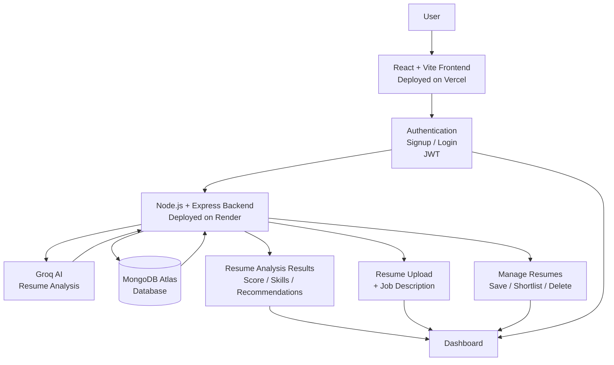

# 🚀 Smart Resume Screener

> An AI-powered web application that analyzes resumes against job descriptions and provides intelligent insights, resume scores, skill analysis, and recommendations.


---

## 🌐 Live Demo

🔗 **Frontend:** https://smart-resume-screener-sigma.vercel.app/

🔗 **Backend API:** https://smart-resume-screener-0haw.onrender.com


---

# 📌 What is Smart Resume Screener?

Smart Resume Screener is a full-stack AI-powered web application designed to help users analyze their resumes according to a specific job description.

Users can create an account, log in securely, upload their resume, provide a job description, and receive AI-generated insights about how well their resume matches the job requirements.

The application also provides a personalized dashboard where users can manage their analyzed resumes.

---

# 🎯 Core Capabilities

- 🔐 Secure User Authentication
- 👤 User Signup and Login
- 🛡️ JWT-based Authorization
- 📄 Resume Upload
- 📝 Job Description Input
- 🤖 AI-powered Resume Analysis
- 📊 Resume Match Score
- 🧠 Skill Analysis
- 💡 AI-generated Recommendations
- 💾 Save Resume Analysis
- ⭐ Shortlist Resumes
- 🗑️ Delete Resumes
- 📋 Personalized Dashboard

---

# ✨ Key Features

## 🔐 Secure Authentication

The application provides a complete authentication system where users can:

- Create a new account
- Log in with registered credentials
- Access protected dashboard features
- Maintain authentication using JWT tokens

Passwords are securely hashed using `bcryptjs`.

---

## 📄 Resume Upload

Users can upload their resumes and provide a job description for analysis.

The backend processes the uploaded resume and uses the provided information for AI-powered screening.

---

## 🤖 AI-Powered Resume Analysis

The application integrates with the **Groq API** to analyze resumes.

The AI analyzes the resume in relation to the provided job description and generates useful insights.

The analysis can help users understand:

- Resume relevance
- Matching skills
- Skill gaps
- Resume-job compatibility
- Improvement recommendations

---

## 📊 Resume Score

The system provides a resume score based on the analysis.

This helps users quickly understand how well their resume matches the provided job description.

---

## 🧠 Skill Analysis

The application identifies important skills related to the resume and job requirements.

This helps users understand which skills are relevant and which areas may need improvement.

---

## 💡 AI Recommendations

Based on the resume analysis, the application provides recommendations to help improve the resume and increase its relevance to the selected job description.

---

## 📋 Personalized Dashboard

After logging in, users are redirected to their dashboard.

The dashboard allows users to:

- View analyzed resumes
- View saved resume information
- Shortlist resumes
- Manage resume records
- Delete resumes

---

## 🏗️ System Architecture



---

# 🔄 Application Workflow

```text
User Signup / Login
        │
        ▼
JWT Authentication
        │
        ▼
Access Dashboard
        │
        ▼
Upload Resume
        │
        ▼
Enter Job Description
        │
        ▼
Resume Processing
        │
        ▼
Groq AI Analysis
        │
        ▼
Resume Score + Skills + Recommendations
        │
        ▼
Save / Shortlist / Delete Resume
```

---

# 📂 Project Structure

```text
smart-resume-screener
│
├── backend
│   │
│   ├── config
│   │   └── db.js
│   │
│   ├── controllers
│   │   ├── authController.js
│   │   └── resumeController.js
│   │
│   ├── middleware
│   │   ├── authMiddleware.js
│   │   └── uploadMiddleware.js
│   │
│   ├── models
│   │   ├── User.js
│   │   └── Resume.js
│   │
│   ├── routes
│   │   ├── authRoutes.js
│   │   └── resumeRoutes.js
│   │
│   ├── services
│   │   └── groqService.js
│   │
│   ├── .env
│   ├── package.json
│   └── server.js
│
├── frontend
│   │
│   ├── public
│   │
│   ├── src
│   │   ├── components
│   │   ├── pages
│   │   │   ├── Home.jsx
│   │   │   ├── Login.jsx
│   │   │   ├── Signup.jsx
│   │   │   └── Dashboard.jsx
│   │   │
│   │   ├── App.jsx
│   │   └── main.jsx
│   │
│   └── package.json
│
├── .gitignore
└── README.md
```

---

# 🛠️ Tech Stack

## 🎨 Frontend

- React.js
- Vite
- JavaScript
- CSS
- React Router DOM

## ⚙️ Backend

- Node.js
- Express.js

## 🗄️ Database

- MongoDB Atlas
- Mongoose

## 🔐 Authentication

- JSON Web Token (JWT)
- bcryptjs

## 🤖 AI Integration

- Groq API

## 📁 File Upload

- Multer

## ☁️ Deployment

- Vercel — Frontend Deployment
- Render — Backend Deployment
- MongoDB Atlas — Cloud Database

---

# 🚀 Getting Started

## 1️⃣ Clone the Repository

```bash
git clone https://github.com/Aayush6555/smart-resume-screener.git
```

Move into the project directory:

```bash
cd smart-resume-screener
```

---

## 2️⃣ Backend Setup

Move into the backend folder:

```bash
cd backend
```

Install dependencies:

```bash
npm install
```

Create a `.env` file:

```env
PORT=5000

JWT_SECRET=your_jwt_secret

MONGO_URI=your_mongodb_connection_string

GROQ_API_KEY=your_groq_api_key
```

Start the backend:

```bash
npm run dev
```

The backend will run on:

```text
http://localhost:5000
```

---

## 3️⃣ Frontend Setup

Open another terminal and move into the frontend folder:

```bash
cd frontend
```

Install dependencies:

```bash
npm install
```

Start the frontend:

```bash
npm run dev
```

The frontend will run on:

```text
http://localhost:5173
```

---

# 🔌 API Endpoints

## Authentication

### Signup

```text
POST /api/auth/signup
```

### Login

```text
POST /api/auth/login
```

---

## Resume Management

### Get Resumes

```text
GET /api/resumes
```

### Upload / Analyze Resume

```text
POST /api/resumes
```

### Delete Resume

```text
DELETE /api/resumes/:id
```

> Protected routes require a valid JWT token.

---

# 🔐 Environment Variables

The backend requires the following environment variables:

| Variable | Description |
|---|---|
| `PORT` | Port used by the backend server |
| `JWT_SECRET` | Secret key used for JWT authentication |
| `MONGO_URI` | MongoDB Atlas connection string |
| `GROQ_API_KEY` | API key for Groq AI integration |

⚠️ **Never upload your `.env` file to GitHub.**

---

# 🌐 Deployment

## Frontend

The React + Vite frontend is deployed on:

**Vercel**

https://smart-resume-screener-sigma.vercel.app/

---

## Backend

The Node.js + Express backend is deployed on:

**Render**

https://smart-resume-screener-0haw.onrender.com

---

## Database

The application uses:

**MongoDB Atlas**

for cloud database storage.

---

# 🧠 Key Learning Outcomes

Through this project, I gained practical experience with:

- Building a complete full-stack web application
- React and Vite development
- Node.js and Express.js backend development
- REST API development
- MongoDB and Mongoose
- JWT-based authentication
- Password hashing using bcryptjs
- File uploads using Multer
- AI integration using the Groq API
- Environment variable management
- Connecting frontend and backend applications
- Cloud deployment using Vercel
- Backend deployment using Render
- Cloud database integration with MongoDB Atlas

---

# 🔮 Future Enhancements

Future improvements may include:

- More detailed AI resume feedback
- Advanced resume scoring
- Downloadable resume analysis reports
- Resume comparison functionality
- Improved dashboard analytics
- Better skill matching
- More supported resume formats
- Enhanced UI and user experience

---

# 👨‍💻 Author

**Aayush Kumar Singh**


---

## ⭐ Support

If you found this project useful or interesting, consider giving the repository a ⭐ on GitHub!
